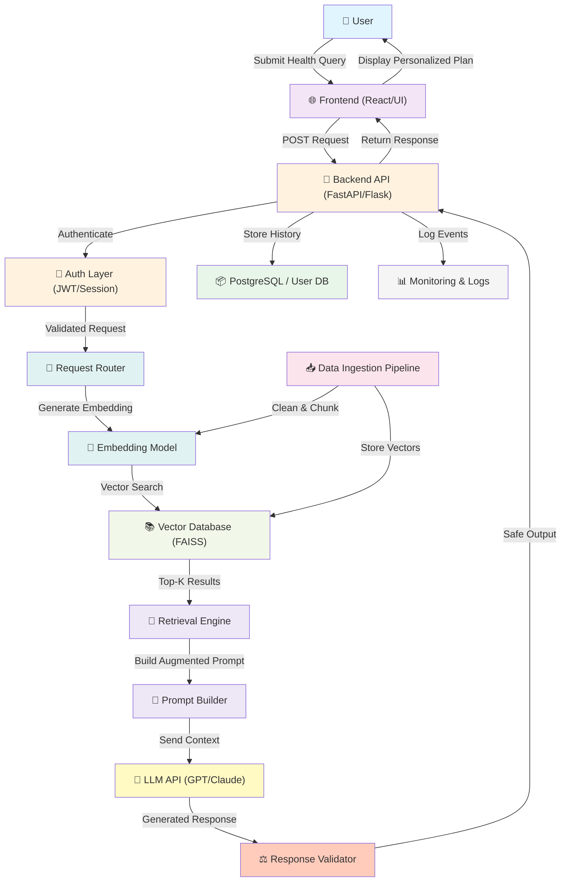

# Retrieval Augumented Generation

## Steps to run the project

### Option 1:

- Step 1: cd into backend directory: 
`cd backend`

- Step 2: run the python file app.py:
`python app.py`

- Step 3: Open a new terminal

- Step 4: cd into frontend:
`cd frontend`

- Step 5: run frontend: `npm start`

- Step 6: open localhost at
[http://localhost:3000](http://localhost:3000)

### Option 2:

- Step 1: Go to file `app.py` in backend directory.

- Step 2: Run the application

- Step 3: Open a new terminal

- Step 4: cd into frontend:
`cd frontend`

- Step 5: run frontend: `npm start`

- Step 6: open localhost at
[http://localhost:3000](http://localhost:3000)# GenFit

🏗️ Architecture

GenFit follows a modular Retrieval-Augmented Generation (RAG) architecture that separates user interaction, semantic retrieval, and LLM-based reasoning.
Each layer is independently scalable and communicates through REST-based services.

